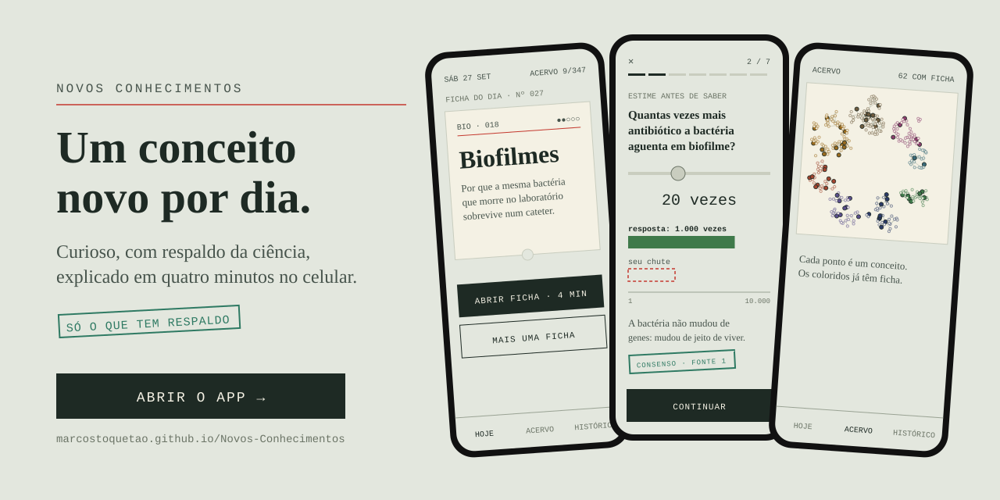
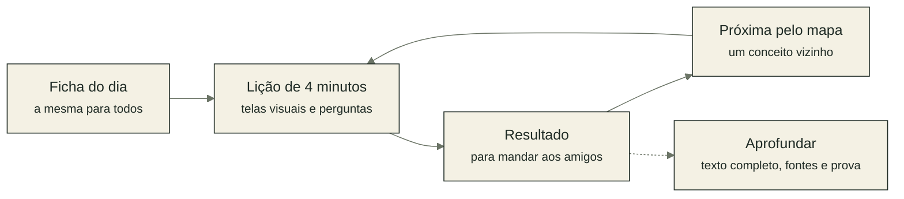
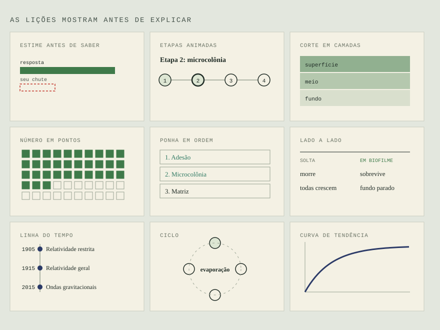
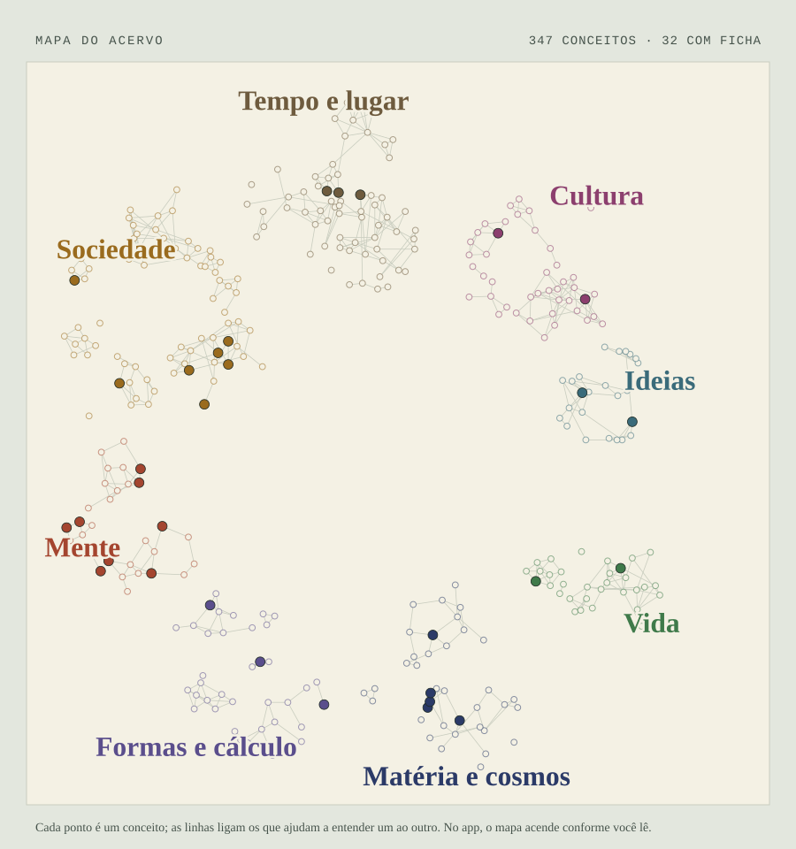
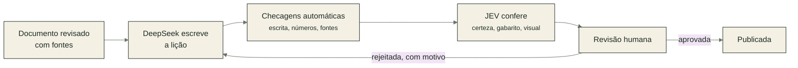

<p align="center">
  <a href="https://marcostoquetao.github.io/Novos-Conhecimentos/"></a>
</p>

<p align="center">
  <a href="https://marcostoquetao.github.io/Novos-Conhecimentos/"><b>Abrir o app</b></a>
  &nbsp;·&nbsp; funciona no navegador do celular, sem cadastro e sem instalar nada
</p>

---

Todo dia o app abre uma ficha nova: um conceito de uma área que você provavelmente não escolheria sozinho. Biofilmes, transformada de Fourier, seleção adversa, línguas de sinais. Você entende o essencial em quatro minutos, testa se ficou e, se quiser, segue para o próximo.

A ficha do dia é a mesma para todo mundo. Dá para comparar o resultado com os amigos.

## Como funciona



## Lições que mostram antes de explicar

<p align="center"></p>

Em vez de parágrafos, a lição é feita de telas curtas. Antes de ver um número, você chuta. Os processos aparecem animados, etapa por etapa. Perguntas no meio do caminho mostram na hora se a ideia ficou. Tudo é desenhado pelo próprio app, então funciona offline e continua leve.

## Só o que tem respaldo

Quem lê sobre um assunto fora da própria área não tem como saber se o texto é sério. Por isso o app declara o grau de certeza de cada afirmação:

- as lições só ensinam o que é **consenso** na área, ou evidência séria e recente marcada como **emergente**;
- cada afirmação importante leva um carimbo com o número da fonte, e tocar nele mostra a referência;
- hipóteses, debates e dados sem confirmação ficam separados no fim do texto completo, numa seção chamada **«Onde a ciência ainda pesquisa»**.

## O acervo

<p align="center"></p>

São 347 conceitos em oito regiões, de Vida a Ideias, ligados pelo que um ajuda a entender do outro. No app, o mapa começa apagado e acende conforme você lê. Hoje 32 conceitos têm ficha completa, e as lições curtas entram aos poucos, depois de passar por revisão.

## No celular

Abra o link e adicione à tela inicial. No Android (Chrome), use o menu de três pontos e **Adicionar à tela inicial**. No iPhone (Safari), use o botão de compartilhar e **Adicionar à Tela de Início**. Depois do primeiro acesso, o app funciona até sem internet.

Seu progresso fica só no seu aparelho. Não há conta, anúncio nem rastreamento pessoal; a contagem de visitas é anônima e sem cookies ([GoatCounter](https://www.goatcounter.com)).

Achou algo errado ou tem uma ideia? Use o botão **Dar uma opinião** no fim de cada lição.

---

<details>
<summary><b>Por dentro do projeto</b></summary>

<br>

O app é HTML, CSS e JavaScript puros, sem framework e sem servidor, publicado pelo GitHub Pages. O conteúdo de cada conceito está em `js/docs/<id>.js`; o `build.js` valida tudo e gera os arquivos que o app baixa sob demanda.

As lições são produzidas por um pipeline barato, com revisão humana antes de publicar:



Cada lição custa em torno de um centavo de dólar para gerar. As notas da revisão viram regras novas no guia de estilo (`pipeline/estilo.md`), e o gerador melhora a cada rodada.

Para rodar localmente:

```bash
python -m http.server 8765        # o app em http://localhost:8765
node build.js                     # depois de editar conteúdo
python pipeline/revisar.py        # fila de revisão das lições
```

Detalhes de arquitetura, convenções de conteúdo e regras de escrita estão em [`CLAUDE.md`](CLAUDE.md).

</details>
